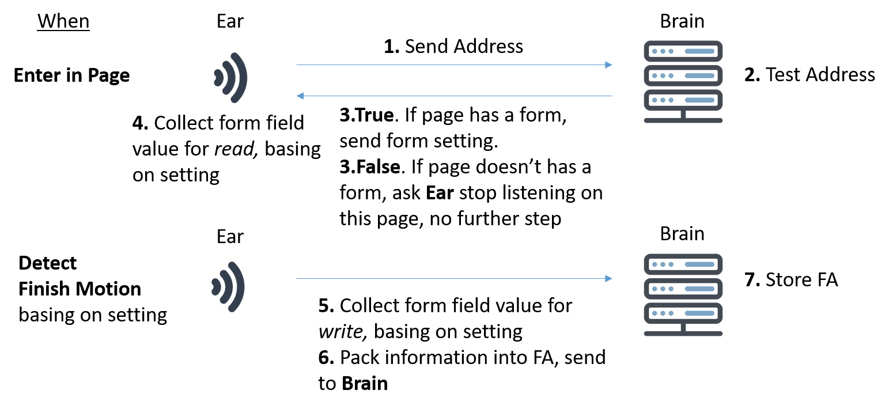
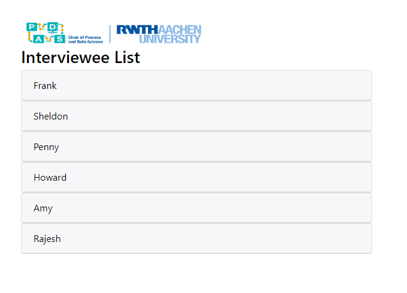
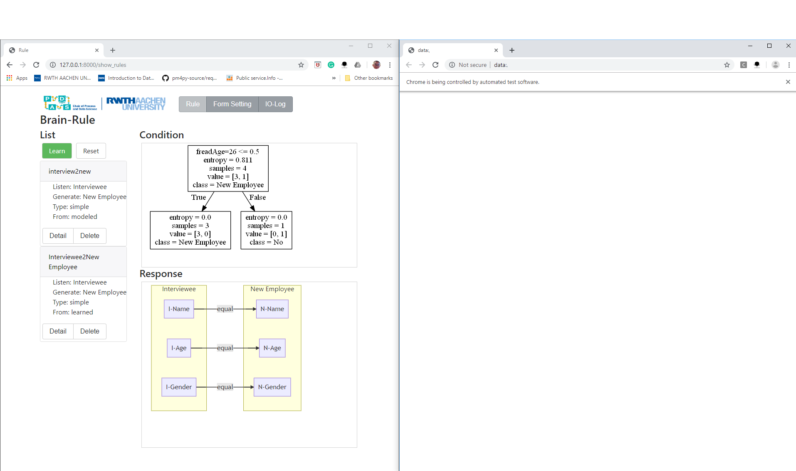

# Form to Rule Self-Learning Approach for RPA

This is a research holding by the Chair of Process and Data Science, RWTH Aachen University.

The more technical detail of this research could be found in our paper, Automated Robotic Process Automation: A Self-Learning Approach. Meanwhile, some paragraphs and pictures in this document quote the paper.

## Overview

The main problems of adopting RPA have two aspects,

(1) domain knowledge requirement, the consultants in the RPA project should know every detail for the business, in order to model the RPA robot's workflow.

(2) labour intensive, current RPA product only provides low-level movement workflow modeler and recorder, every movement of mouse click and keyboard stroke should be modeled or recorded, otherwise, the robot would not know how to do the business.

For solving these two problems, we provide a novel End-to-End Approach for RPA, it is called Form to Rule Self-Learning Approach (F2R Approach), it allows the robot learns from the user, less domain knowledge requirement, less human intervention.

For empowering RPA robot the ability of self-learning, we purpose three steps,

(1) Task identification, know what user do/did.
Doing daily business in IT system could be seen as filling a set of forms, such as fill a Purchase Order form in SAP.
We purpose an abstracted structure of form, which consists form name and fields, and define such forms for IT system segments where we are interesting for adopting RPA.
It is easy for collecting interactions on such forms, and we only collect in high-level, e.g. fill a form, update a form, not the low-level mouse clicks, etc., we call this high-level interaction as form action, the log of form action is called IO-Log.
By doing this procedure, the robot could know user is/was doing what.
And this step is the cornerstone of the F2R Approach.

(2) Rule deduction, learn from user. Repetitive tasks are the target scenarios for adopting RPA. As the tasks are repetitive, it is reasonable that it could be detected from IO-Log, and we purpose a standard element for describing those tasks, which is called rule.
The rule is the "if ... then ...'' statement, this is a widely applied definition for RPA. A rule could be interpreted as "if user finished a particular action, then he/she will do a certain action in the next, deterministically ".

(3) Rule application, working with the user. It is obvious the ``then'' part in rule could be automatically executed by the robot. Thus, in operation, the robot listens on forms, if certain action happened, it will perform the suitable rule, without hesitation.

And these three steps could be illustrated as the Figure below. This picture is quoted from the paper.
<!--  -->

<div align=center>

</div>

## The Example of Defining A Form in F2R Approach

The example of transferring a real form in the IT system to a form in F2R Approach is in below. This is a form on the webpage, it has four valuable fields. It could be written as FI=(I,{ Name, Age, Gender, Result}). In the paper, we also mention the issue of form instance id, as the limit of time we will implement it in the future.


For achieving the FI=(I,{ Name, Age, Gender,Result}) form, we should do some define, we call it form setting. It could be written as below.

```json
{
    "name": "Interviewee",
    "type": "web",
    "address": "http://127.0.0.1:5001/interviewee_form",
    "form_field": [
      {
        "name": "Name",
        "address": "/html/body/div/div[2]/div[2]/form/div[1]/input"
      },
      {
        "name": "Age",
        "address": "/html/body/div/div[2]/div[2]/form/div[2]/input"
      },
      {
        "name": "Gender",
        "address": "/html/body/div/div[2]/div[2]/form/div[3]/select"
      },
      {
        "name": "Result",
        "address": "/html/body/div/div[2]/div[2]/form/div[4]/select"
      }
    ],
    "begin_route": {
      "motion": [
        {
          "motion": "click",
          "address": "/html[1]/body[1]/div[1]/div[2]/div[1]/div[1]/div[2]/div[1]/div[{{name}}]/div[1]/a[1]"
        },
        {
          "motion": "click",
          "address": "/html[1]/body[1]/div[1]/div[2]/div[1]/div[1]/div[2]/div[1]/div[{{name}}]/div[2]/a[1]"
        }
      ],
      "motion_variable": [
        "name"
      ],
      "how_arrive": "get",
      "start_address": "http://127.0.0.1:5001/interviewee_list"
    },
    "finish_route": {
      "motion": "click",
      "address": "/html[1]/body[1]/div[1]/div[2]/div[2]/form[1]/button[1]",
      "destination_address": "http://127.0.0.1:5001/interviewee_list"
    }
  }
```

Form setting tells RPA robot all the information about the form it needs to know.
RPA robot has some basic skills for understanding this setting, and the rest about the rule, the RPA robot will learn by itself.
It is like teaching the robot to drive a car, not teaching the robot to drive to a certain address, after the robot knows how to drive, we just give it the address.

## RPA Robot Structure in F2R Approach

After this, RPA robot could collect user interactions (form action, IO-Log), learning rules from IO-Log, and applying rules for working with user. Each of these abilities we design a component, ear, brain, arm. Ear is for hearing the FA; brain is for deducing the rule and memorize the IO-Log, and arm is for translating the response FA, which is the result of the rule, on IT system.

<div align=center>

</div>

<!-- Here are two videos for the running examples. -->

This example is showing the procedure of robot learning rules from IO-Log.
And, the rule is deduced by the Decision Tree Algorithm.


For implementation of each component, ear is done by a Chrome-extension(running in Chrome's back-end) in JavaScript; brain is done by a web-service in Python; arm is done by Selenium(Web-page automation software) in Python.

## The detailed procedure of RPA robot collecting IO-Log and doing response

For collecting IO-Log, two main steps for collecting single FA.
Firstly, at the moment of the user entering in an arbitrary web-page, Ear will send this page’s address (URL) to Brain, Brain tests this page contains a form or not by matching the address with form settings.
If this page does not has a form, Brain will ask Ear to stop listen on this page; otherwise, Brain will send the detail form setting to Ear, and Ear collects information from fields and puts into the entering state in FA.
Secondly, after detecting user has finished this form, Ear collects information from the fields again and puts into the leaving state in FA; then Ear packs all the information into an FA and sends to Brain; Brain stores the received FA.
This procedure is illustrated by the Figure below.


The advantages of collecting IO-Log based on form setting are accuracy, effectiveness, and privacy.
The robot collects information from the specific elements on the web-page, it ignores other no-value elements and user's arbitrary motions, this mechanism is more accurate and effective compared with current RPA products.
And, Ear only listens to the pages have forms, user's interactions with other pages will be ignored, this way could keep the user's privacy, effectively.

This example is showing the procedure of robot listening on the form and does response.


For doing response, after FA stored, Brain will match this FA with rules. If this FA meets a certain rule's condition, Brain will generate a response FA by this rule.
Then, Brain will send this FA to Arm, it will reach a new form and translate FA into detail movements, after this, Arm will execute the submit motion. This procedure is illustrated by the Figure in below.


## Installation

This is an ongoing project, the main idea of the paper is implemented in this project. Currently, it just stay at the stage of the proof of concept, it doesn't have the ability for adoption in the production environment.
This project only supports the RPA robot interacts with the webpage system on Chrome.

### Dependencies for this implementation

(1) Python 3.6.5, we recommend using the Anaconda.

- Flask 1.0.2, it is for back-end server.

- Selenium 3.141.0, it is for implementing the robot arm.

- Scikit-learn 0.19.1, it is for training the robot rule.

- Graphviz 0.9, it is for visualizing the decision tree, which is learn by the Scikit-learn

- Pandas 0.24.1, it is for data manipulation.

(2) Javascript, it is for the front-end and Chrome-extension.

- Jquery 1.9.1

- Bootstrap 4.0.0

- mermaidjs 0.5.0

Thanks a lot for these brilliant projects, otherwise, we couldn't finish this.

### Installation

After you have prepare your python.
And make sure the port "5001", "5002", "8000" is available on your computer.

(1) Install IO_log_collector, IO_log_collector is in the folder 'IO_log_collector', it's chrome-extension. This part is about the ear of the robot.

Get chrome://extensions/;
turn on develop mode for your Chrome, and unpack the IO_log_collector. More detail you may need, you could find in [here](https://developer.chrome.com/extensions/getstarted).

(2) Run the SDAP scenario's fake system. SDAP scenario is an end-to-end example which is mentioned in the paper. It has two systems, one is for the interview, one is for the employee. These two systems are in the "fake_system" folder.

- "\interview" is for the interview system, you could run it by double click on the "run.bat", you will see a cmd window for running this system, and it runs at the <http://127.0.0.1:5001>. You could use Chrome to get this URL, and you will see the UI  like below,


- "\employee" is for the employee system, you could run it by double click on the "run.bat", you will see a cmd window for running this system, and it runs at the <http://127.0.0.1:5002>. You could use Chrome to get this URL, and you will see the UI  like below,


(3) Run the F2R robot, it is about the brain and arm of the robot. It is in the folder of "server", you could double click on the "run.bat" to run it. It will trigger a cmd window to run the robot backend, and a Chrome to run the robot arm. And the robot runs at <http://127.0.0.1:8000>, you could use the other Chrome to browse it. After this, you will see something like the Figure in below.


The left side is the robot brain, which is at <http://127.0.0.1:8000>. 
The right side is the robot arm, which is automatically triggered when you run the robot.

As the purpose of evaluating the idea, we tried to make this project as easy to install as possible. Thus, we haven't adopt any database in this project. Information is kept in files.

- "\server\form_setting.json" is for the form setting. We define form in this file.

- "\server\data.json" is for storing the IO-Log. After ear received the form action, it will put into this file.

- "\server\rule.json" is for storing the modeled rule. The rule is could be modeled, not just from learning.

Each component could be reset by the restart. So, please feel free to play with it. And the usage could be found in the previous animation.
