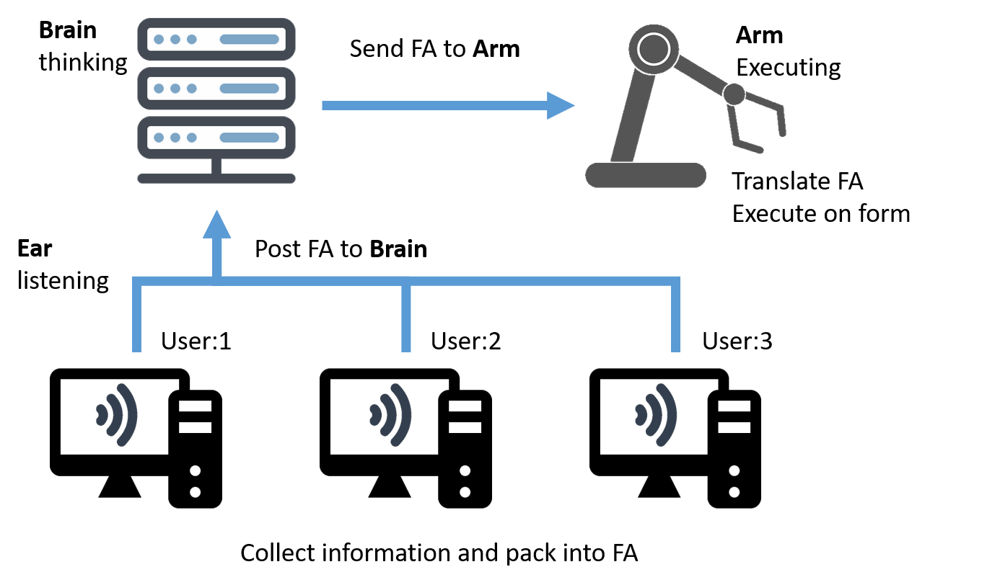

The example of transferring a real form in IT system to a form in F2R Approach is in below. This is a form on webpage, it has four valuable fields. It could be written a s FI=(I,{ Name, Age, Gender,Result}). In paper, we also mention the issue of form instance id, as the limit of time we will implement it in future.


For achieving the FI=(I,{ Name, Age, Gender,Result}) form, we should do some define, we call it form setting. It could be written as below.

```json
{
    "name": "Interviewee",
    "type": "web",
    "address": "http://127.0.0.1:5001/interviewee_form",
    "form_field": [
      {
        "name": "Name",
        "address": "/html/body/div/div[2]/div[2]/form/div[1]/input"
      },
      {
        "name": "Age",
        "address": "/html/body/div/div[2]/div[2]/form/div[2]/input"
      },
      {
        "name": "Gender",
        "address": "/html/body/div/div[2]/div[2]/form/div[3]/select"
      },
      {
        "name": "Result",
        "address": "/html/body/div/div[2]/div[2]/form/div[4]/select"
      }
    ],
    "begin_route": {
      "motion": [
        {
          "motion": "click",
          "address": "/html[1]/body[1]/div[1]/div[2]/div[1]/div[1]/div[2]/div[1]/div[{{name}}]/div[1]/a[1]"
        },
        {
          "motion": "click",
          "address": "/html[1]/body[1]/div[1]/div[2]/div[1]/div[1]/div[2]/div[1]/div[{{name}}]/div[2]/a[1]"
        }
      ],
      "motion_variable": [
        "name"
      ],
      "how_arrive": "get",
      "start_address": "http://127.0.0.1:5001/interviewee_list"
    },
    "finish_route": {
      "motion": "click",
      "address": "/html[1]/body[1]/div[1]/div[2]/div[2]/form[1]/button[1]",
      "destination_address": "http://127.0.0.1:5001/interviewee_list"
    }
  }
```

Form setting tells RPA robot all the information about the form it needs to know.
RPA robot has some basic skills for understanding this setting, and the rest about the rule, RPA robot will learn by itself.
It is like teaching the robot to drive a car, not teaching the robot to drive to a certain address, after the robot knows how to drive, we just give it the address.

## RPA Robot Structure in F2R Approach

This step should be done by human, after this, RPA robot could collect user interactions (form action, IO-Log), learning rules from IO-Log, and applying rules for working with human. Each of these ability we design a component, ear, brain, arm. Ear is for hearing the FA; brain is for deducing the rule and memorize the IO-Log, and arm is for translating the response FA, which is the result of rule, on IT system.


Here are two videos for the running examples.

This example is showing the procedure of robot learning rules from IO-Log.


This example is showing the procedure of robot listening on the from and do response.


